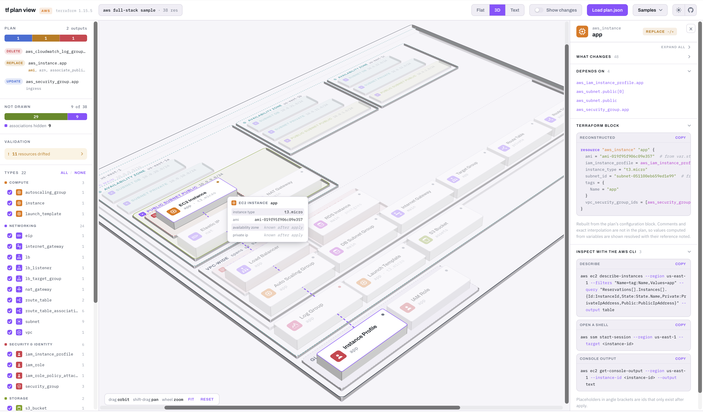

# tf plan view

Renders a `Terraform` plan as an `AWS` architecture diagram. 



Runs in the browser with no AWS API access, using `tf plan` json as the only input.

Designed as a single html page - available at [https://dmkskd.github.io/tf-plan-view/](https://dmkskd.github.io/tf-plan-view/)

## How to use

1. Generate the `terraform` json plan

```
cd <terraform-dir>
terraform plan -out=plan.out
terraform show -json plan.out > plan.json
```

2. Open the project's index.html ([available as github page](https://dmkskd.github.io/tf-plan-view/))
```sh
just open
```

3. Load the generated `plan.json` with the **Load plan json** button or by dropping it on the
page.

Files are read in the browser and never uploaded. 
**Sample plan** loads
plans embedded in `index.html`.

## Things to know

- AWS only. Other providers are reported, not supported.
- Unrecognised resource types are drawn as dashed amber tiles and reported.

See [DEVELOPMENT.md](DEVELOPMENT.md) to modify or verify the app.
